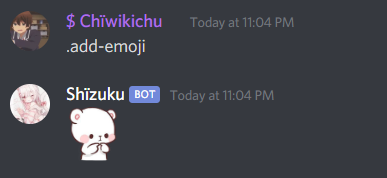

# $addEmoji

This function takes care of automatically adding an emoji to the server using the provided URL.


The URL of the original image must be under 256kb in size.


#### Fields:

This function has 2 properties who are required and another 1 optional.  
The order it's the next:

1. URL \(Required\)
2. Name \(Required\)
3. returnEmoji \(Optional\)
4. roleIDs \(optional\)

Raw Usage: `$addEmoji[url;name;returnEmoji (yes/no)(optional);roleID1;roleID2;...]`

#### Options:

* `URL` - The url of the image/gif that's being converted to an emoji
* `Name` =&gt; The name of the emoji
* `returnEmoji (yes/no)` =&gt; Returns the emoji that was newly created 
* `roleIDs` =&gt; array of roles' IDs they should have access to that emeji. Only members with these role would have access to see and use that emoji. Leave it empty to set to everyone.

An example of the use should be the next:

#### Usage

```javascript
bot.command({
    name: "add-emoji",
    code: `$addEmoji[https://cdn.discordapp.com/emojis/786763619438166036.png;shy_bear;yes]`
});
```

#### Example result:




URL NEEDS to end in `.gif`, `.png` or `.jpg`


