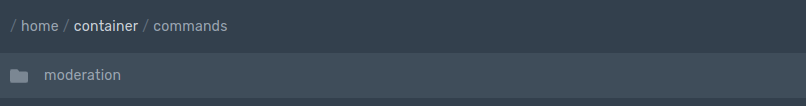
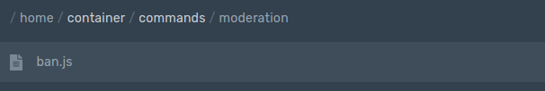

# Command Handler

### Adding Command Handler

<table>
  <tr>
  <th align="left">index.js</th>
  </tr>
  <tr>
  <td>

  ```javascript
  bot.loadCommands(`./commands/`)
  ```
  </td>
  </tr>
</table>

> ℹ️ `commands` can be renamed to any directory folder.

<table>
  <tr>
  <th align="left"> index.js </th>
  </tr>
  <tr>
  <td>

  ```javascript
  $updatecommands //It will update the commands in the inital path.
  ```

  </td>
  </tr>
</table>

> ℹ️ `$updatecommands` can be used with `bot.loadCommands`

### Main File example

This is a example of how to use `bot.loadCommands(./commands/)` in your main index.

<table>
  <tr>
  <th align="left"> index.js </th>
  </tr>
  <tr>
  <td>

  ```javascript
  const aoijs = require("aoi.js")

  const bot = new aoijs.Bot({
    token: "TOKEN", //Discord Bot Token
    prefix: "PREFIX" //Discord Bot Prefix
  })

  bot.onMessage() //Allows to execute Commands

  bot.command({
    name: "ping", //Trigger name (command name)
    code: `Pong! $pingms` //Code
  })

  bot.readyCommand({
    channel: "", //You can use this or not
    code: `$log[Ready on $userTag[$clientID]]` //Example Ready on Client
  })

  bot.loadCommands(`./commands/`) //Allows Commands executed by `commands` folder
  ```
  </td>
  </tr>
</table>

### Command Handler Folder Setup

> ⚠ Create a folder named `commands`


> ⚠ Make a subfolder



> ⚠ Finally, make your file



### Setting up a command with command handler.

<table>
  <tr>
  <th align="left"> example.js </th>
  </tr>
  <tr>
  <td>

  ```javascript
  module.exports = {
    name: "name",
    code: `your code/message`
  }
  ```
  </td>
  </tr>
</table>

## Using different command types \(e.g. commands from callback events\) in the command handler

For other commands, like the bot.joinCommand, you just have to find the part behind `bot.`- take it and insert this part at the type option as in the example below. 

`bot.joinCommand` becomes `type: 'joinCommand',`   
`bot.userUpdateCommand` becomes `type: 'userUpdateCommand'` etc. 

The type line isn't needed for normal `bot.command` commands. Just write your code like in the code block above.

<table>
  <tr>
  <th align="left"> example.js </th>
  </tr>
  <tr>
  <td>

  ```javascript
  module.exports = {
    type: 'joinCommand',
    channel: "$systemChannelID",
    code: `your code/message`
  }
  ```
  </td>
  </tr>
</table>

## Multiple commands in one file

If you want to use multiple commands inside one command handler file, do it like this:

<table>
  <tr>
  <th align="left"> example.js </th>
  </tr>
  <tr>
  <td>

  ```javascript
  module.exports = [{
    type: 'joinCommand',
    channel: '773364744240496640',
    code: `Welcome $userTag !!`
  }, {
    name: 'ping',
    code: `Pong! $pingms`
  }]
  ```
  </td>
  </tr>
</table>
