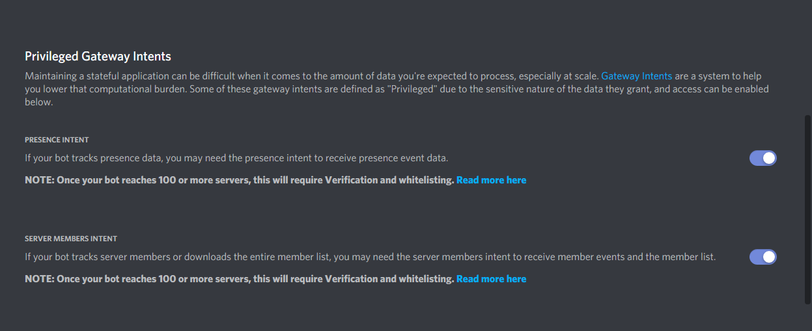

# Gateway Intents

## Gateway Intents

Gateways are Discord's form of real-time communication over secure WebSockets. Clients will receive events and data over the gateway they are connected to and send data over the REST API.  
  
This will be needed for us to interact with the Discord API and the functions that are prepared to build your bot.  
  
You can enable this in the [Discord Developer Portal through your Bot Application](https://discord.com/developers/applications)

And there we go, You're now able to access their API and you shouldn't have any errors or bugs _besides the errors in your own code_

If your bot is verified and you don't have the intents but you want to enable them you will need to [Submit a request](https://support.discord.com/hc/en-us/requests/new?ticket_form_id=360005592534) and explain what intents you want to use in your bot and for what.

