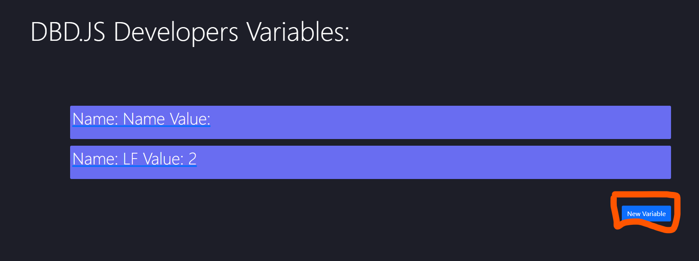

# dbd.express


**THIS DOES NOT WORK in Aoi.JS v3.0.0 and above.**


## Introduction

Your personal dashboard to use to create, edit or delete commands. Add variables or a status...maybe more events! The dashboard is made for user friendly with customizable UI you can make with HTML / CSS

## Getting Started

First of all, you must download [dbd.express](https://www.npmjs.com/package/dbd.express)! & [aoi.js](https://www.npmjs.com/package/aoi.js) to have access to the dashboard!

### Main File

```javascript
const dbdExpress = require("dbd.express")
const Aoijs = require("aoi.js")

const bot = new Aoijs.Bot({ //Creates ur dbdjs bot
   token: "token",
  prefix: "!"
})

const Dashboard = new dbdExpress(bot)
Dashboard.API({
  port: process.env.PORT, //Put any port you want
  useSecureProtocol:true,
  authorizationKey: "Bearer root@1234",
 headers:{
  'Authorization': 'Bearer root@1234',
  'Content-Type': "application/json"
}
})

Dashboard.createUI() //Creates the defualt dashboard UI

bot.onMessage()
```

### Adding an Account

You should use an [eval](../../functions/usdeval.md) command to djs eval the following code

```javascript
$djsEval[client.Express.addAccounts({
username: "username", //any username <3
password: "password" //Make sure its secure!
})]

/*
NOTICE:
If you get
"Cannot get 'push' of undefined" error, run this code first:
$djsEval[new Promise ( async resolve => {
await client.Express.loadUtils()
resolve()
})]
*/
```

### Logging In

Now you need to go to the dashboard home page


Once you've logged in, you should appear to this page!


## Commands, Callbacks, Variables

### Commands

#### Creating Commands

Hey! Now that you have your account, lets make a commands!


Now that you've clicked on it, you should appear on the command list page!


Once you've clicked 'New Command', you should fill out the command name and code!


#### Editing Commands

If you'd like to edit a command, hit the 3 dots and hit 'Edit'


After that, just save your newly edited command!

#### Deleting Commands

If you want to delete a command. Press the 3 dots and hit 'Delete'


There is a confirmation just incase if you misclick!

### Callbacks

#### Creating callbacks

Firstly, make a command like normal, but now pick which callback you want


Now once you've picked one, name it whatever, for my example its just named 'joincommand'

This is very important. At the bottom of the command editor, once you see 'add property', add a property named `channel` and put a channel id or a variable there


#### Editing Callbacks

Edit your callbacks like you would normally

#### Deleting Callbacks

Delete your callbacks like you would normally

### Variables

#### Creating Variables

When creating a variable, you should go over to the variable page found on the nav bar


Once you're there, you should click 'New Variable'



Once you've clicked the button, you should fill out your desired variable information


Now just hit 'Save Variable' 

#### Editing Variables

Editing the variables is just slightly different then commands. Instead of clicking the 3 dots, you just click the underlined text


Then just edit them like normal! _Don't forget to save your changes &lt;3_

#### Deleting Variables

Deleting the variables are basically the same as editing them but instead of changing anything, you hit 'Delete Variable'


There is a confirmation just incase you misclick

